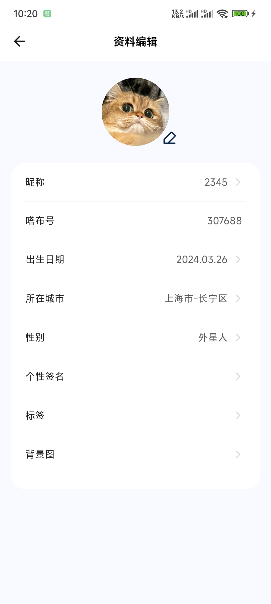
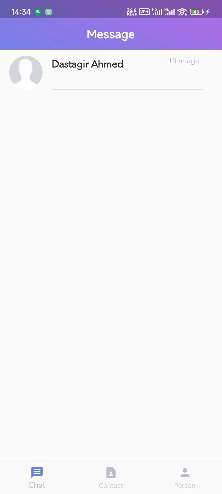

# 功能设计

# base
仿小红书demo 如何启动： 下载完成后 导入到vscode npm i 安装依赖 npm run dev 启动项目 技术栈 react（react-router）全家桶：用于构建用户的MVVM框架 redux：状态管理容器 redux-thunk：处理异步逻辑的 redux 中间件 react-lazyload: react 懒加载库 axios: 用来请求后端api的数据 styled-components: 处理样式，体现css in js的前端工程化 antd-mobile：来自阿里的开源组件库 fastmock：免费的后端数据接口
使用react-router对路由进行配置，在配置中采用懒加载Lazy实现路由懒加载效果，并结合Suspense使用。

使用fastmock模拟数据，api目录下有request.js/config.js 对数据请求进行封装，可读性好

react.memo 作用是减少渲染重复未变的数据

下拉刷新使用antd-moblie 中的PullToRefresh 可以自定义下拉或者下拉后的显示内容。在页面中加入下拉刷新，可以增加用户体验。

回退问题使用navigate(-1)

顶部导航栏(栏中栏) Tab栏使用antd-mobile封装好的

瀑布流布局 限宽不限高

点赞收藏 定义状态 设置去反函数，用classname动态类名控制最初样式，点击图标时触发取反函数，让图标发生改变

图片懒加载 引入LazyLoad 让首屏的加载速度提升，从远程请求来的图片资源在需要的时候加载出来，不需要的时候使用占位图片，优化用户体验

弹出框以及grid布局

弹出框使用antd-moblie中的Popup 用position指定弹出的位置(position:'top')bodyStyle设置内容样式区域
弹出框里面的内容采用grid网格布局
购物车小图标 同吸顶导航栏原理一样 position: fixed; bottom: 80px; right: 30px; z-index: 9999;

搜索功能 通过redux完成简单的模糊搜索，并添加防抖函数

App.jsx

引入底部导航和路由显示页面
main.jsx

使用Provider组件实现所有组件共享store
BrowserRouter包裹App将会监听URL的变化
routes/index.jsx

Suspense 等待异步组件时渲染一些额外内容，让应用有更好的用户体验
lazy懒加载 只有在正真使用该对象时，才会创建这个对象
Components/Footer

useLocation 出现某个页面跳转后不显示底部导航栏
Badge 阿里封装好的徽标
Link to链接 classnames合并类名
Pages/Home

useNavigate 编程实现路由导航
Tabs 内容组之间进行导航切换
Pages/Home/Food + ListFour

map属性遍历
嵌套组件ListFour
useState 定义点赞状态(起始值设为false) changeIsLike 改变状态
lazyLoad懒加载图片 优化页面效率
Pages/Home/Like + Scroll(难点) + ListThree(类似ListFour)

forceCheck
PullToRefresh 在列表中通过手指下拉刷新加载新内容的交互操作。
Pages/Message + Pages/Mine 待开发

Pages/Shop

setVisible2 设置隐藏可见
Popup 弹出层
Pages/Shop/Recommend + Pages/Shop/Sport(同首页面一样)

大难点Search 模糊搜索 搜索分为两部分，由 Search 组件和 SearchBox 组件完成，并在搜索上加入了防抖函数 用户输入数据后，对数据进行防抖处理，然后将输入的值传入 Search 组件，Search 组件根据传过来的值 dispatch 并对返回的搜索结果进行渲染。在项目中的数据里，有 title 关键字和 content 内容两种标签，当不论触发那种标签时，都可以显示出结果列表

memo 的作用是可以实现减少渲染重复未变数据。如果你的组件在相同 props 的情况下渲染相同的结果，那么你可以通过将其包装在 React.memo 中调用，以此通过记忆组件渲染结果的方式来提高组件的性能表现。

# 进度

- [x] 登录(注册)
  - [x] 手机号登录
  - [x] 密码登录
- [ ] 我的
  - [ ] 主页展示
    - [x] 个人资料
    - [x] 动态
    - [ ] 点赞、评论、收藏、浏览记录(待评估)
  - [x] 设置
    - [x] 账号与安全
    - [ ] 隐私设置
    - [x] 通知设置
  - [x] 编辑资料
    - [x] 头像、背景修改
    - [x] 昵称、签名修改
    - [x] 出生日期、所在城市、性别选择
    - [x] 标签修改
- [x] 关注、粉丝、互关
  - [x] 基本列表项
  - [x] 关注、取关等交互
  - [x] 置顶、修改备注等交互
- [ ] 社区
  - [x] 主要列表项(社区、关注、附近)
  - [ ] 列表项展示
    - [x] 图片视频组件封装
    - [x] 圈子、话题组件封装
    - [x] 点赞、关注等交互
    - [ ] 详情页
      - [x] 顶部基本信息
      - [x] 主要内容区域
      - [ ] 底部评论(待评估)
- [x] [im聊天](./docx/im聊天.md)
  - [ ] 聊天列表
  - [ ] 聊天界面
- [ ] 寻搭
- [ ] 发布动态
  - 参考 https://github.com/huangruiLearn/flutter_hrlweibo/tree/master
- [x] [缺省图、基类封装、错误重试](./docx/基类封装.md)
  - 网络请求基于Retrofit+Dio实现，配合官方JsonSerialize实现解析
  - 网络请求的基础封装
  - 封装项目页面多状态（加载中，成功，失败，空数据
- [ ] UI
  - [x] [自定义圆弧指示器](./docx/自定义圆弧indicator.md)
  

# 部分截图

已实现

    
  
  
  

    
  
  
  

    
  
  

    
  
  
  

    
  
  
  

    
  
  

待优化

    
  
  

    
  
  

待实现

    
  
  
  

# 产品设计文档
https://lxe4xw.axshare.com/?id=3fd07a523a8e4a81addb237859e49f42