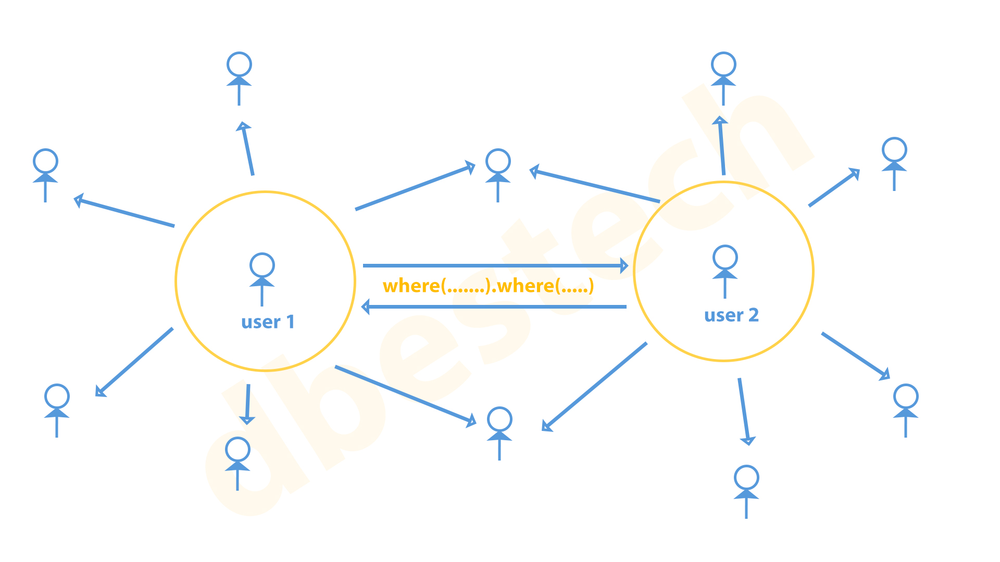
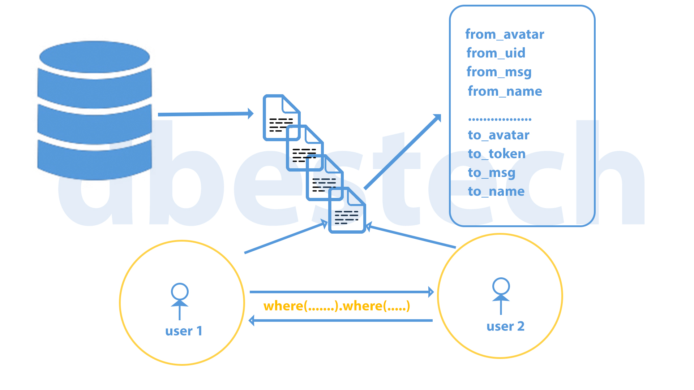

# 基础结构

每个用户拥有唯一的doc_id，类似于数据库中的表，每个doc指向数据库中的一行。





消息发送 A -> B

区分消息来源更精准的匹配消息列表(不做这一步会导致大量冗余的消息)

A 发出去的所有消息 form_message:

```dart
// A作为接收方拿到从A发给B的所有消息
var from_messages = await db
  .collection("message")
  .withConverter(
    fromFirestore: Msg.fromFirestore,
    toFirestore:(Msg msg,options)=> msg.toFirestore())
  .where("from_uid",isEqualTo: token)  // A发的所有消息
  .where("to_uid",isEqualTo: to_userdata.id)  // B收到的所有消息
  .get();
```

B 发出去的所有消息 to_message:

```dart
// A作为接收方拿到从B发给A的所有消息
var to_messages = await db
  .collection("message")
  .withConverter(
    fromFirestore: Msg.fromFirestore,
    toFirestore:(Msg msg,options)=> msg.toFirestore())
  .where("from_uid",isEqualTo: to_userdata.id)  // B发的所有消息
  .where("to_uid",isEqualTo: token)  // A收到所有消息
  .get();
```

## 数据库结构

```json
"message":{
  "消息id":
    {
    "from_avatar": "xxxxx",
    "from_name": "xxxxx",
    "from_uid": "xxxxx",
    "last_msg": "xxxxx",
    "last_time": "xxxxx",
    "msg_num": "xxxxx",
    "to_avatar": "xxxxx",
    "to_name": "xxxxx",
    "to_uid": "xxxxx",
  }
}
```

**如果没有过消息**

```dart
if (from_messages.docs.isEmpty && to_messages.docs.isEmpty){
  String profile = await UserStore.to.getProfile();
  UserLoginResponseEntity userdata= UserLoginResponseEntity.fromJson(jsonDecode(profile));
  // 定义一个空消息
  var msgdata = Msg(
    from_uid:userdata.accessToken,
    to_uid: to_userdata.id,
    from_name: userdata.displayName
    to name: to userdata.name
    from_avatar:userdata.photoUrl
    to_avatar: to_userdata.photourl
    last_msg: ""  // 空消息
    last_time: Timestamp.now()  // 当前时间
    msg_num:0
  );

  // 消息添加到数据库
  db.
    .collection("message")
    .withConverter(
      .fromFirestore: Msg.fromFirestore,
      .toFirestore:(Msg msg,options)=> msg.toFirestore())
    .add(msgdata)
    .then((value) => {
      // 跳转到聊天页面
    })
}
```

**如果有过发送消息**

```dart
else {
  if (from_messages.docs.isNotEmpty) {
    Get.toNamed('/chat', parameters: {
      'doc_id': from_messages.docs.first.id,  // 这里使用first是因为from_messages返回一个集合，他应该只有一个对象
      'to_uid': to_userdata.id ?? '',
      'to_name': to_userdata.name ?? '',
      'to_avatar': to_userdata.photourl ?? '',
    });
  }
  if (to_messages.docs.isNotEmpty) {
    Get.toNamed('/chat', parameters: {
      'doc_id': to_messages.docs.first.id,
      'to_uid': to_userdata.id ?? '',
      'to_name': to_userdata.name ?? '',
      'to_avatar': to_userdata.photourl ?? '',
    });
  }
}
```

## 消息

### 发送消息 sendImageMessage

定义消息结构

```dart
final content = Msgcontent(
  uid: user_id,
  content: url,
  type: 'image',
  addtime: Timestamp.now(),
);

```

插入数据库

```dart
await db
    .collection('message')
    .doc(doc_id)
    .collection('msglist')
    .withConverter(
        fromFirestore: Msgcontent.fromFirestore,
        toFirestore: (Msgcontent msgcontent, options) =>
            msgcontent.toFirestore())
    .add(content)
    .then((DocumentReference doc) {

  textController.clear();
  Get.focusScope?.unfocus();
});
```

更新最后时间

```dart
await db.collection('message').doc(doc_id).update({
  'last_msg': '[image]',
  'last_time': Timestamp.now(),
});
```

## 监听消息

onReady 中监听消息列表的变化，点击发送发送消息是在首位插入新消息

```dart
@override
  void onReady() {
    super.onReady();
    var messages = db
        .collection('message')
        .doc(doc_id)
        .collection('msglist')
        .withConverter(
            fromFirestore: Msgcontent.fromFirestore,
            toFirestore: (Msgcontent msgcontent, options) =>
                msgcontent.toFirestore())
        .orderBy('addtime', descending: false);

    state.msgcontentList.clear();

    listener = messages.snapshots().listen(
      (event) {
        for (var change in event.docChanges) {
          switch (change.type) {
            case DocumentChangeType.added:
              if (change.doc.data() != null) {
                state.msgcontentList.insert(0, change.doc.data()!);  // 插入新消息
              }
              break;
            case DocumentChangeType.modified:
              break;
            case DocumentChangeType.removed:
              break;
          }
        }
      },
      onError: (error) => print('Listen failed: $error'),
    );

    getLocation();
  }
```

## 界面

```dart
SliverChildBuilderDelegate(
  (context, index) {
    var item = controller.state.msgcontentList[index];
    if (controller.user_id == item.uid) {
      // 自己发送
      return chatRightItem(item);
    }

    // 别人发来的消息
    return chatLeftItem(item);
  },
  childCount: controller.state.msgcontentList.length,
),
```